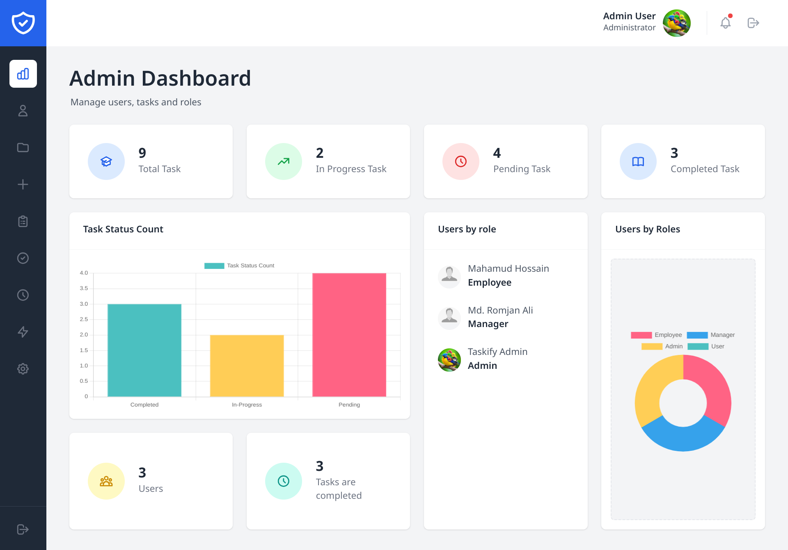
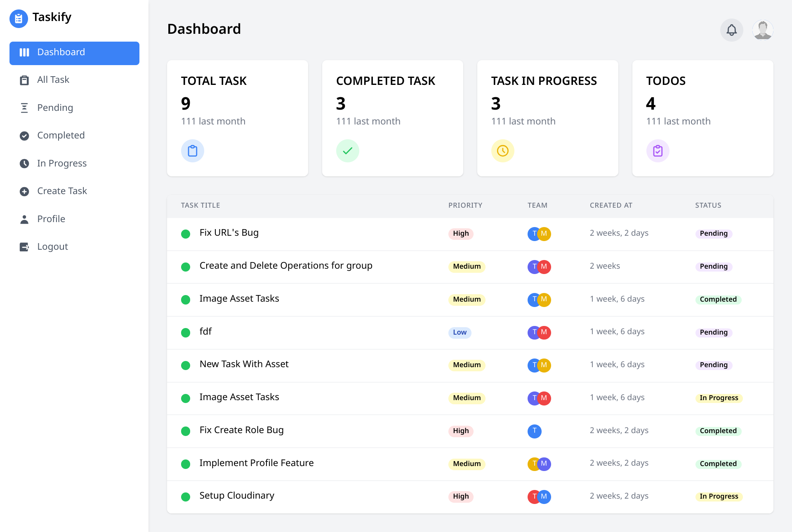

# Taskify

Taskify is a task management system built using **Django**, **Tailwind CSS**, and **HTML**. It features **Role-Based Access Control (RBAC)**, optimized database queries, and a **customized dashboard** for different user roles (Admin, Manager, and Employee). Additionally, **Django Signals** are used to send emails upon task assignment and user activation after registration.

## Features

- **Role-Based Access Control (RBAC)**
  - **Admin:** Full access to the system.
  - **Manager:** Can create, update, delete, and assign tasks.
  - **Employee:** Can view and complete assigned tasks.
- **Optimized Queries** for better performance.
- **Customized Dashboard** for Admin, Manager, and Employee.
- **Django Signals** for email notifications:
  - Sends an email when a task is assigned.
  - Sends an activation email upon registration.
- **User Authentication & Authorization**
- **Responsive UI** built with **Tailwind CSS**

## Screenshots

### Admin Dashboard



### Manager Dashboard



## Demo Credentials

Use the following credentials to log in and test the system:

### Admin

```plaintext
username: testAdmin
Password: DemoAdmin#43
```

### Manager

```plaintext
Email: testManager
Password: DemoManager#43
```

### Employee

```plaintext
Email: testEmployee
Password: DemoEmployee#43
```

## Installation

1. **Clone the Repository:**
   ```bash
   git clone https://github.com/your-username/taskify.git
   cd taskify
   ```
2. **Create a Virtual Environment and Activate It:**
   ```bash
   python -m venv venv
   source venv/bin/activate  # On Windows use `venv\Scripts\activate`
   ```
3. **Install Dependencies:**
   ```bash
   pip install -r requirements.txt
   ```
4. **Apply Migrations:**
   ```bash
   python manage.py migrate
   ```
5. **Create a Superuser (Optional):**
   ```bash
   python manage.py createsuperuser
   ```
6. **Run the Development Server:**
   ```bash
   python manage.py runserver
   ```
7. **Access the Application:**
   Open [http://127.0.0.1:8000/](http://127.0.0.1:8000/) in your browser.

## Technologies Used

- **Django** - Backend framework
- **Tailwind CSS** - Frontend styling
- **HTML** - Templating
- **Django Signals** - Handling email notifications
- **PostgreSQL/MySQL (Optional)** - Database

## Contributing

If you would like to contribute, feel free to submit a pull request!

## License

This project is licensed under the MIT License.

---

Made with ❤️ by Md. Romjan Ali
